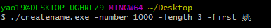
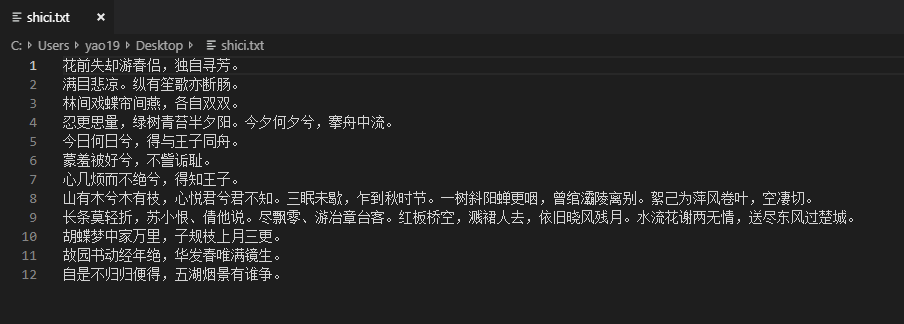

# CREATE NAME 创造新名字
```
 ________   _______   ___       __   ________   ________  _____ ______   _______      
|\   ___  \|\  ___ \ |\  \     |\  \|\   ___  \|\   __  \|\   _ \  _   \|\  ___ \     
\ \  \\ \  \ \   __/|\ \  \    \ \  \ \  \\ \  \ \  \|\  \ \  \\\__\ \  \ \   __/|    
 \ \  \\ \  \ \  \_|/_\ \  \  __\ \  \ \  \\ \  \ \   __  \ \  \\|__| \  \ \  \_|/__  
  \ \  \\ \  \ \  \_|\ \ \  \|\__\_\  \ \  \\ \  \ \  \ \  \ \  \    \ \  \ \  \_|\ \ 
   \ \__\\ \__\ \_______\ \____________\ \__\\ \__\ \__\ \__\ \__\    \ \__\ \_______\
    \|__| \|__|\|_______|\|____________|\|__| \|__|\|__|\|__|\|__|     \|__|\|_______|

```
# 不要用windows自带的编辑器
## 功能说明
1. 大规模生成名字,总有一个你满意
2. 使用自定义的名字生成内容,只需要建立`shici.txt`文件,放入你中意的诗词，而不需要删除符号
3. 自定义姓氏,只需要加上`-first `
## 下载
[点击下载](https://github.com/tungyao/createname/releases)`https://github.com/tungyao/createname/releases`
## 运行方式 ：
1. 双击运行
2. cmd : `name.exe`  参数 ：`-number 100 (需要多少个名字,默认100) -length 3 (几位的名字,默认3位) -first 李 (默认 周)`

3. 如果在当前目录下有`shici.txt`文件存在,将使用里面的内容,下面是示范,不需要删除中文符号

## 运行结果
会在当前目录生成 `name.txt`
